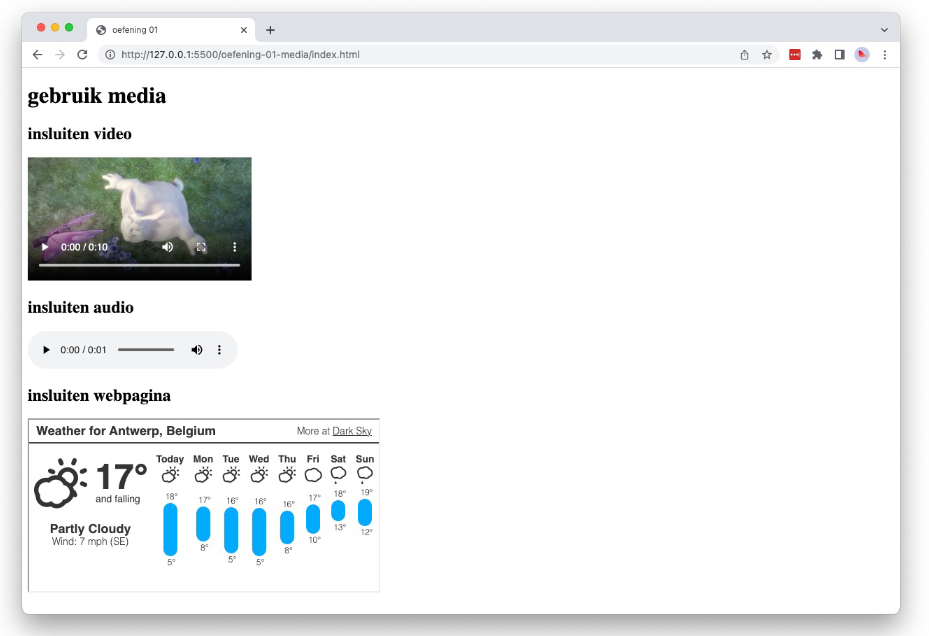

# 💻 03. HTML & Bootstrap > oefening 01

## 🛠️ opdrachten

### `index.html` maken

- [ ] Maak een nieuw bestand genaamd `index.html` aan in deze map.
- [ ] Open het bestand.

### voorbeeld namaken

- [ ] Maak het volgende voorbeeld na met behulp van HTML. Gebruik hiervoor de elementen uit de vorige labo's, en zoek op hoe je gebruik maakt van de elementen `video`, `audio` en `iframe`.

### bijlagen

- [ ] Maak

## 💡 vragen

- Waarvoor dient het `controls`-attribute?
- Waarvoor staat de `source`-element?
- Wanneer gebruik je meerdere `source`-elementen?
