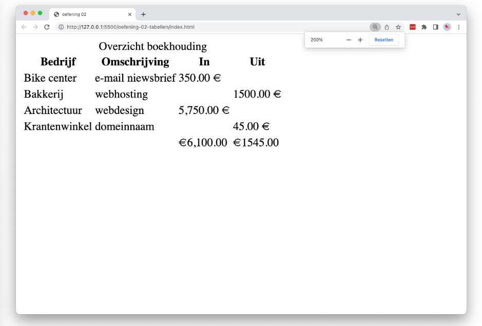

# 💻 LES: W3 - HTML & Bootstrap - Oefening 02

## 🛠️ Opdrachten

### `index.html` maken

 - [ ] Maak een nieuw bestand genaamd `index.html` aan in deze map.
 - [ ] Open het bestand.
 - [ ] Voeg de [bootstrap meta-informatie](/README.md) toe aan je `head` element om bootstrap te kunnen gebruiken.

### Voorbeeld Namaken

- [ ] Maak een [semantische tabel](https://apwt.gitbook.io/g_webtechnologie/html/html-tabellen). Maak gebruik van de elementen `caption`, `table`, `thead`, `tbody` en `tfoot`. In die elementen maak je gebruik van de elementen `th` (met `scope="col"`), `tr` en `td`.
- [ ] Gebruik de [correcte HTML entiteiten](https://apwt.gitbook.io/g_webtechnologie/html/html-speciale-karakters) voor de euro-tekens en lege cellen.

## 💡 Vragen

 - Wat is het verschil tussen de elementen `th` en `td`?